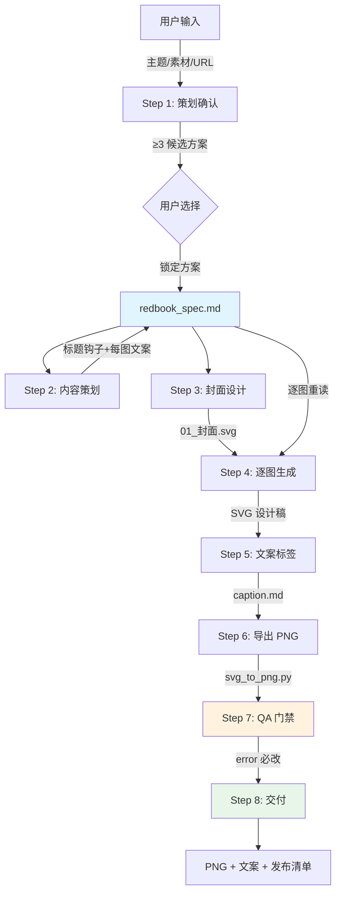
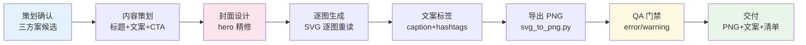

# redbook-content-skill

> 一键生成可发布的小红书九宫格图文 —— 从主题/素材到 SVG 设计稿、PNG 成品、发布文案，全流程自动化。

---

## 项目简介

**redbook-content-skill** 是一个 Claude Code Skill（技能插件），让 AI 代理能够将任意主题或素材转化为一组可直接发布到小红书的竖版图文。

小红书图文 ≠ 长文配图，而是「封面钩子 + 九宫格信息图 + 文案标签」三位一体的内容形态。本技能完整覆盖了这个生产链路：从视觉系统策划（调性 × 配色 × 封面公式）、逐图 SVG 设计、PNG 栅格化导出，到发布文案与标签生成，最终通过 QA 门禁确保交付质量。

**核心设计理念**：先锁定全局设计上下文，再逐图生成，最后过质量门禁 —— 不要边想边画。

---

## 核心能力

| 能力 | 说明 |
|------|------|
| 🎨 **9 种调性风格** | 治愈系、高级感、干货风、活泼风、文艺风、极简风、复古风、纯欲风、科技风 |
| 🎯 **14 套配色方案** | 基于 60-30-10 法则，每套含真实 HEX 值，覆盖从奶油暖调到科技冷光 |
| 📐 **8 种封面公式** | 大字报、对比、清单、数字冲击、Before-After、人物金句、提问式、测评打分 |
| ✍️ **完整内容策划** | 标题钩子（≤20字）、逐图文案、结尾 CTA、标签策略（大词+长尾） |
| 🖼️ **SVG → PNG 导出** | 多后端自动回退（Playwright → resvg → cairosvg），支持 1x/2x 输出 |
| ✅ **QA 质量门禁** | 安全区、字号一致性、配色合规、移动可读性等 error/warning 级检查 |
| 📋 **三方案候选** | 策划阶段自动生成 ≥3 个差异化方案供用户选择，避免 AI 独断 |

---

## 效果展示

```
输入：帮我写一篇关于早起习惯的小红书

输出：
├── redbook_spec.md    ← 设计锁定文件（调性×配色×字号×图文结构）
├── svg_output/        ← 9 张 SVG 设计稿
│   ├── 01_封面.svg
│   ├── 02_痛点.svg
│   ├── 03_方法一.svg
│   ├── 04_金句.svg
│   ├── 05_方法二.svg
│   ├── 06_方法三.svg
│   ├── 07_对比.svg
│   ├── 08_清单.svg
│   └── 09_结尾.svg
├── png/               ← 9 张 2484×3320 高清 PNG
└── caption.md         ← 发布文案 + 3-8 个 #话题标签
```

---

## 应用场景

| 场景 | 典型主题 |
|------|----------|
| 🌱 **种草分享** | 护肤成分科普、好物推荐、穿搭灵感 |
| 📈 **涨粉引流** | 知识干货、技能教程、职场经验 |
| 📝 **测评对比** | 产品横评、方法对比、前后变化 |
| 📚 **教程指南** | 步骤拆解、工具推荐、学习路径 |
| 💡 **观点输出** | 金句合集、认知升级、读书笔记 |

---

## 安装部署

### 让 AI 自己安装（最简单）

直接在 Claude Code 中告诉 AI：

```
帮我安装 redbook-content-skill
```

AI 会自动完成克隆仓库和配置。

### 手动安装

```bash
# 1. 克隆仓库
git clone https://github.com/guyue356/redbook-content-skill.git

# 2. 在 Claude Code 中加载技能
#    技能目录结构应为：
#    redbook-content-skill/
#      SKILL.md           ← 技能主文件
#      AGENTS.md          ← Agent 伴随文件
#      references/        ← 参考规范
#      templates/         ← 模板文件
#      scripts/           ← 工具脚本
```

### 安装 PNG 导出依赖（可选）

SVG → PNG 导出需要以下任一后端：

```bash
# 方案 A：Playwright（推荐，保真度最高）
pip install playwright
playwright install chromium

# 方案 B：resvg（轻量，下载二进制加入 PATH）
# https://github.com/nickel-org/nickel.rs/releases

# 方案 C：cairosvg（纯 Python）
pip install cairosvg
```

---

## 快速开始

在 Claude Code 中直接输入：

```
/redbook-content-skill 帮我写一篇关于早起习惯的小红书
```

AI 会自动：

1. **展示 ≥3 个候选方案**（调性 × 配色 × 封面公式），让你挑选
2. **锁定设计系统**，写入 `redbook_spec.md`
3. **逐图生成 SVG 设计稿**（封面 → 内容图 → 结尾图）
4. **导出高清 PNG**（2484×3320）
5. **生成发布文案 + 标签**
6. **通过 QA 门禁**后交付

---

## 使用说明

### 触发方式

```
/redbook-content-skill 帮我写/做一篇小红书
/redbook-content-skill 生成小红书图文
/redbook-content-skill 小红书种草，主题是护肤
/redbook-content-skill 把这个链接做成小红书图文：https://...
```

### 支持的输入类型

| 输入类型 | 示例 |
|----------|------|
| 主题词 | `早起习惯`、`护肤种草`、`时间管理` |
| 素材文档 | URL、docx、pdf、md 文件 |
| 组合输入 | 素材 + 指定调性/风格 |

### 交互流程

```
用户输入主题
  ↓
AI 提出 ≥3 个候选方案（调性×配色×封面公式）
  ↓
用户选择/调整方案
  ↓
AI 锁定 redbook_spec.md
  ↓
逐图生成 SVG（每图重读 spec 防漂移）
  ↓
导出 PNG → QA 门禁 → 交付
```

---

## 系统架构



---

## 核心工作流程

### 8 步生产流水线



### 关键纪律

| 纪律 | 说明 |
|------|------|
| **先锁定再生成** | Step 1-2 完成前不画任何像素 |
| **逐图重读 spec** | 每张图生成前 `read_file redbook_spec.md`，不凭记忆 |
| **字号跨图恒定** | 同角色（封面大字/小标题/正文/标注/页脚）跨图同 px，不漂移 |
| **只用品色** | fill/stroke 仅用 spec 锁定的配色，禁止临场新色 |
| **安全区** | 顶部 ≥140px、底部 ≥180px 留空，防被 APP UI 遮挡 |

---

## 技术栈

| 层级 | 技术 | 用途 |
|------|------|------|
| **运行时** | Claude Code Skill | AI 代理技能框架 |
| **设计格式** | SVG（1242×1660, 3:4） | 矢量设计稿，可无损缩放 |
| **栅格化** | Playwright / resvg / cairosvg | SVG → PNG 多后端回退 |
| **脚本语言** | Python 3.8+ | svg_to_png.py 工具脚本 |
| **质量保证** | 人工 QA + 自动评估 | quality-check.md 门禁 + run_evals.py |
| **版本控制** | Git | 源码管理 |

---

## 项目结构

```
redbook-content-skill/
├── SKILL.md                          # 技能主文件（完整工作流规范）
├── AGENTS.md                         # Agent 伴随文件（激活方式与摘要）
├── references/                       # 参考规范（设计系统知识库）
│   ├── visual-system.md              #   9 种调性 × 14 套配色 × 8 种封面公式
│   ├── content-anatomy.md            #   爆款图文解剖：标题钩子、节奏、标签策略
│   ├── typography.md                 #   字号五档 ramp、字体栈、移动可读性规则
│   ├── quality-check.md              #   QA 门禁：error/warning 级检查项
│   └── svg-clean-rules.md            #   SVG 清洁规则：不放标签/引流/账号名/页码
├── templates/                        # 模板文件
│   └── redbook_spec.md               #   设计锁定文件模板（唯一真相源）
├── scripts/                          # 工具脚本
│   ├── svg_to_png.py                 #   SVG → PNG 栅格化（多后端回退）
│   └── run_evals.py                  #   评估运行器（结构检查 + 金用例）
├── evals/                            # 评估规范
│   └── redbook-content-skill.eval.md #   二元检查 + 金用例定义
└── LICENSE                           # MIT License
```

### 核心文件职责

| 文件 | 职责 |
|------|------|
| `SKILL.md` | 技能大脑：完整 8 步工作流、每步规范、纪律清单 |
| `redbook_spec.md` | 唯一真相源：锁定调性/配色/字号/图文结构，逐图重读 |
| `visual-system.md` | 风格目录：9 种调性 × 14 套配色 × 8 种封面公式 |
| `svg_to_png.py` | 生产工具：SVG → PNG，自动多后端回退 |
| `quality-check.md` | 质量门禁：14 项 error + 5 项 warning 检查 |

---

## 配置说明

### 设计锁定文件（redbook_spec.md）

每次生成都会产出一个 `redbook_spec.md`，包含：

```markdown
## 基础信息
- 画布：1242 × 1660（3:4）
- 账号定位 / 目标：种草分享

## 调性与风格
- 调性：治愈系
- 封面公式：大字报

## 配色（60-30-10）
| 角色 | HEX | 占比 |
|------|------|------|
| 主色 | #FBF7F0 | 60% |
| 辅色 | #E8DFD3 | 30% |
| 点缀 | #C9A227 | 10% |

## 字号 ramp（跨图恒定）
| 角色 | 锁定 px |
|------|---------|
| 封面大字 | 120 |
| 小标题 | 56 |
| 正文 | 38 |
| 标注 | 26 |
```

### PNG 导出参数

```bash
python svg_to_png.py <svg_dir> --out <png_dir> [--scale 2] [--backend auto]

# 参数说明：
#   --scale 2      # 2x 输出（2484×3320，默认）
#   --scale 1      # 1x 输出（1242×1660）
#   --backend auto # 自动选择后端（默认）
#   --backend playwright  # 指定后端
```

---

## 性能与扩展性

### 设计系统扩展

- **调性**：在 `references/visual-system.md` 的调性目录中添加新行
- **配色**：在配色目录中添加新方案（保持 60-30-10 结构）
- **封面公式**：在封面公式目录中添加新公式

### 质量门禁扩展

- **error 级**：在 `references/quality-check.md` 的 error 表中添加新检查项
- **warning 级**：在 warning 表中添加新检查项

### 脚本扩展

`svg_to_png.py` 采用后端注册模式，添加新渲染后端只需：

```python
def render_new_backend(svg_path: Path, png_path: Path, scale: int) -> bool:
    # 实现渲染逻辑
    return png_path.exists()

BACKENDS["new_backend"] = render_new_backend
```

---

## 安全设计

### SVG 清洁规则

| 红线 | 原因 |
|------|------|
| 不放 `#话题` 标签 | 标签给算法看，不该占图中版面 |
| 不放「关注/收藏/点赞」引导 | 会被平台判定营销，降推荐权重 |
| 不放账号名/品牌名 | 反复刷脸降低可信度 |
| 不放页码 | 九宫格流式浏览，页码是噪音 |
| 正文颜色 ≥ `#2B2B2B` | 手机小屏 + 强光环境，浅色不可见 |

### XML 实体转义

SVG 是 XML 格式，以下字符必须转义（否则渲染失败）：

| 字符 | 转义 | 常见场景 |
|------|------|----------|
| `&` | `&amp;` | 「对话 & 研究」→「对话 &amp; 研究」 |
| `<` | `&lt;` | 数学表达式 |
| `>` | `&gt;` | 比较表达式 |

---

## 项目亮点

### 1. 设计系统思维

不是让 AI 随机生成图片，而是建立了一套完整的设计系统：9 种调性 × 14 套配色 × 8 种封面公式 = **1008 种组合**，每种都有明确的视觉特质、推荐配色、字体气质和真实博主类比。

### 2. 先锁定再生成

「先锁定全局设计上下文，再逐图生成」—— 通过 `redbook_spec.md` 作为唯一真相源，逐图重读，杜绝 AI 常见的「边想边画、风格漂移」问题。

### 3. 字号跨图恒定

同角色（封面大字/小标题/正文/标注/页脚）跨图用同一 px —— 这是「像设计过」与「像 AI 生成」的分水岭。

### 4. 多后端回退

`svg_to_png.py` 自动尝试 Playwright → resvg → cairosvg 三个后端，任一可用即可成功导出，无需用户手动选择。

### 5. 完整 QA 门禁

14 项 error 级检查 + 5 项 warning 级检查，覆盖安全区、字号一致性、配色合规、移动可读性、XML 转义等关键质量点。

---

## Roadmap

- [ ] 支持更多小红书内容形式（视频脚本、直播话术）
- [ ] 增加 AI 背景插画生成集成
- [ ] 支持批量生成（多篇图文一次性产出）
- [ ] 增加自动发布到小红书的 API 集成
- [ ] 支持自定义调性/配色/封面公式

---

## 贡献指南

欢迎贡献新的调性、配色方案或封面公式！

1. Fork 本仓库
2. 在 `references/visual-system.md` 中添加新方案
3. 确保遵循 60-30-10 配色法则和现有格式
4. 提交 PR 并说明添加理由

---

## FAQ

### Q: 为什么用 SVG 而不是直接生成 PNG？

SVG 是矢量格式，可以无损缩放、方便修改、文件体积小。先生成 SVG 设计稿，再通过 `svg_to_png.py` 栅格化为 PNG，既保留了编辑灵活性，又确保最终输出符合小红书的图片要求。

### Q: 画布为什么是 1242×1660？

这是 3:4 比例，小红书主推的竖版图片比例。1242px 宽度在手机端按 ≈1080px 显示，字号经过优化确保移动可读性（正文 ≥34px、标注 ≥24px）。

### Q: 为什么每张图都要重读 redbook_spec.md？

AI 生成多张图时容易「记忆漂移」—— 后面的图逐渐偏离最初锁定的设计系统。逐图重读 spec 是对抗这种漂移的核心纪律。

### Q: 三个后端有什么区别？

| 后端 | 保真度 | 速度 | 依赖 |
|------|--------|------|------|
| Playwright | 最高（浏览器渲染） | 较慢 | 需安装 Chromium |
| resvg | 高（Rust 实现） | 快 | 需下载二进制 |
| cairosvg | 中（纯 Python） | 中 | `pip install cairosvg` |

### Q: 可以自定义调性或配色吗？

可以。在 `references/visual-system.md` 中按现有格式添加新调性/配色/封面公式即可，技能会自动识别和使用。

---

## License

[MIT License](LICENSE) © 2026 guyue356
